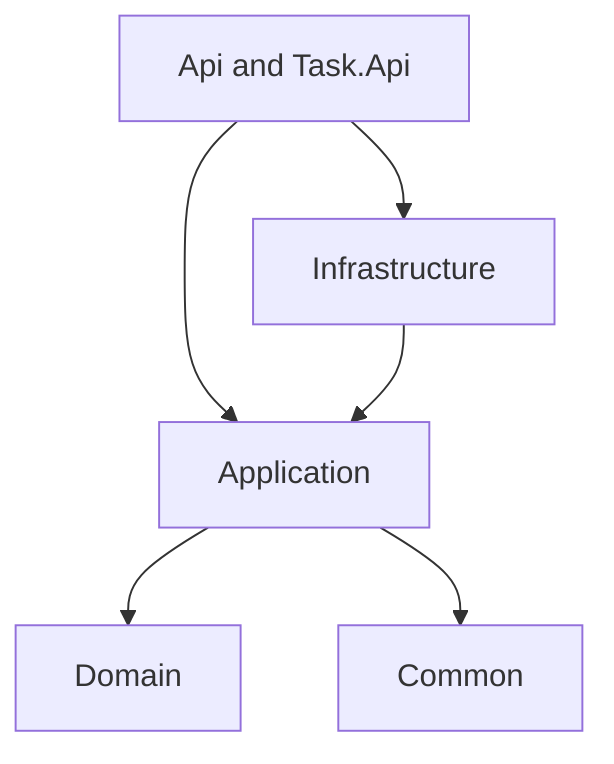
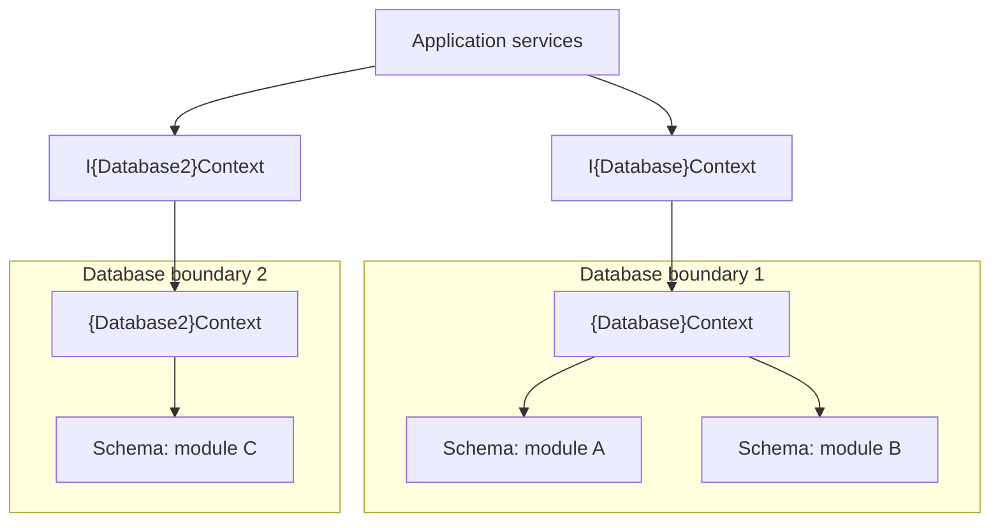
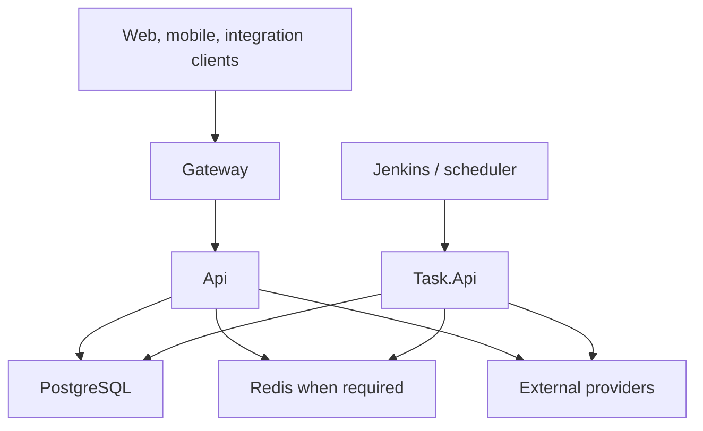

# .NET Application Architecture

> Architecture contract for a multi-tenant .NET application. Applies to human- and AI-written code alike.

**Baseline:** .NET 10 · ASP.NET Core · EF Core 10 + Npgsql 10 · PostgreSQL · **database-first schema**.
`{Project}` `{Database}` `{Module}` `{Provider}` are placeholders, not extra layers.
**MUST / MUST NOT / SHOULD** need a documented reason to break. Build optional pieces only when a requirement appears.

## 1. Principles

1. **Onion + modular monolith.** Dependencies point inward. Application declares contracts, Infrastructure implements them. Modules are logical, not deployable.
2. **Domain references nothing** — no EF, ASP.NET, logging, cache, DI. Common also has zero project references.
3. **One function, one coherent job.** A use case may validate, load, mutate and commit as one operation. No forwarding methods.
4. **Classes only when responsibility demands it.** No interface/factory/manager per concrete class.
5. **No MediatR.** Controllers inject application services. Cross-cutting = filters, middleware, EF interceptors, one exception handler.
6. **No repository pattern.** Services write LINQ against `I{Database}Context`; they never touch a concrete context.
7. **One save per unit of work.** The operation owner commits once; participants stage only.
8. **Contexts are named after databases** — `{Database}Context`, never `MainContext`. Multiple schemas ≠ multiple contexts.
9. **Modules talk through service interfaces.** No writing another module's entities, no leaking tracked entities or `IQueryable`.
10. **Tenant isolation lives in the model**: named query filters for reads, write guards for writes. Never hand-written tenant predicates.
11. **The schema is owned by versioned SQL scripts.** EF maps an existing database. No EF migrations.
12. **One JWT engine, three trust profiles** — different scheme, audience, claims, lifetime and keys; same code.
13. **One HTTP exception boundary** with a stable Problem Details contract.
14. **Structured observability**: Serilog → Elasticsearch, `GenericLog.Add(...)`, Elastic APM, shared correlation ids.
15. **English code, localized UI.** The client maps stable `errorCode` values.

## 2. Forbidden by Default

| Forbidden | Instead |
| --- | --- |
| MediatR, pipeline behaviors, domain events, in-process bus | Plain services, filters, interceptors |
| Repository / UnitOfWork wrappers | `I{Database}Context` + LINQ |
| EF migrations, `Migrations/`, `EnsureCreated()` in real environments | Versioned SQL in `scripts/sql/` |
| Committed scaffolded entities with data annotations | Hand-written entities + `IEntityTypeConfiguration<T>` |
| AutoMapper for trivial mapping, generic CRUD base classes | Explicit projection, purpose-named methods |
| `saveChanges: bool` flags, hidden commits | Explicit commit ownership |
| Parameterless `IgnoreQueryFilters()`, lazy-loading proxies | Named bypass, explicit `Include`/projection |
| Swashbuckle | `Microsoft.AspNetCore.OpenApi` + Scalar |
| Concrete `DbContext` outside Infrastructure | The context interface |
| Logic in Gateway, schedulers in Api | Gateway = edge only, Task.Api = all jobs |

## 3. Layers and Dependencies



| Project | References | Owns |
| --- | --- | --- |
| `Domain` | none | Entities, enums, invariants, markers, filter-name constants |
| `Common` | none | Exceptions, extensions, small security primitives |
| `Application` | Domain, Common | Use cases, module contracts, context abstractions, request/response models |
| `Infrastructure` | Application | EF, JWT, cache, logging, health, external adapters |
| `Api` | Application, Infrastructure | HTTP boundary, authorization, validation, composition |
| `Task.Api` | Application, Infrastructure | Job endpoints, scheduler, system identity |
| `Gateway` | none | YARP routing, IP rules, edge rate limits |

Transitive references grant nothing: no concrete context in controllers, no Common in Domain. Provider packages (Npgsql, Serilog, ASP.NET Core) stay in Infrastructure and hosts. Verification checks references *and* forbidden namespaces.

## 4. Solution Layout

```
{Project}.slnx   ARCHITECTURE.md   CLAUDE.md   global.json
Directory.Build.props   Directory.Packages.props   docker-compose.yml
src/
  {Project}.Domain/          Common/ Constants/ Enums/ {Database}/{Module}/
  {Project}.Common/          Exceptions/ Security/ Extensions/
  {Project}.Application/     Abstractions/ Common/ {Module}/{Models,Validators}/
  {Project}.Infrastructure/  Persistence/{Contexts,Configurations,Interceptors,DbInitializer}/
                             Auth/ Sessions/ Caching/ Logging/ Health/ ExceptionHandling/
                             External/{Provider}/ DependencyInjection.cs
  {Project}.Api/             Controllers/ Authorization/ Validation/ Middleware/ OpenApi/ Services/
  {Project}.Task.Api/        Controllers/ Authentication/ Jobs/ Services/
  {Project}.Gateway/         proxy and edge policy only
tests/   TestKit/ UnitTests/ ServiceTests/ IntegrationTests/
scripts/ verify.ps1
         sql/changes/  forward-only numbered DDL — schema source of truth
         sql/schema/   generated snapshot, review only
         sql/seed/     idempotent reference data
docs/    error-codes.md, operational notes, decision records
```

Create folders as content requires them. The exception handler and health registration live in Infrastructure so both hosts reuse them; hosts never reference each other. Documentation count is not fixed.

## 5. Naming

| Element | Pattern |
| --- | --- |
| Context | `{Database}Context` / `I{Database}Context` |
| Service | `{Module}Service` / `I{Module}Service` |
| Use case | `{Verb}{Subject}Async` — one observable outcome |
| Models | `{Verb}{Subject}Request`, `{Subject}Response`, `{Subject}ListItem` (`record`) |
| Mapping | `{Entity}Configuration` under `Configurations/{Database}/{Module}/` |
| Validator / Interceptor | `{Request}Validator` / `{Concern}Interceptor` |
| External adapter | `{Provider}{Capability}Client` behind `I{Capability}Service` |
| Job | `{Job}JobController.RunAsync`, route `jobs/{job-name}` |
| SQL script | `{seq}_{verb}_{object}.sql` |
| Error code | `SCREAMING_SNAKE_CASE`, never renamed after release |
| PostgreSQL | `snake_case` schemas, tables, columns |

Namespace mirrors folder. Services and configurations are `sealed`. Async methods carry `Async` and a `CancellationToken`.

## 6. Function, Class and Module Design

- Extract a function when it names a business rule, removes real duplication, isolates an external call, or clarifies a complex block — not to shorten a method.
- Create a class for cohesive behavior/state, a meaningful contract, a required boundary, or independent variation. A folder is not a reason.
- Interfaces are for module boundaries, context contracts and replaceable infrastructure; internal helpers need none.
- One service per cohesive module; split when responsibilities diverge, not per endpoint.
- The initiating service owns the use case and the commit; called modules stage without saving. Document commit ownership on write contracts.
- Cross-module reads go through contracts. Resolve cycles by moving orchestration to the initiating use case, never a service locator.
- Guard clauses over nesting. No boolean mode parameters, no `.Result`, `.Wait()` or fire-and-forget request work.

## 7. Technology Baseline

| Concern | Baseline |
| --- | --- |
| Runtime | .NET 10, ASP.NET Core, centrally pinned versions |
| Persistence | EF Core 10 + Npgsql 10, **mapping an externally owned schema** |
| Schema | Versioned SQL in `scripts/sql/`, applied by a deployment step |
| Naming translation | `EFCore.NamingConventions`, or explicit `snake_case` mapping |
| Validation | DataAnnotations *recommended*, optional — §13.4 |
| Cache | FusionCache (L1; Redis L2 + backplane when replicas need it) |
| JWT | JwtBearer + `Microsoft.IdentityModel.JsonWebTokens` |
| Logging / tracing | Serilog + `Elastic.Serilog.Sinks` · Elastic APM agent |
| Jobs | HTTP job endpoints in Task.Api; Hangfire optional |
| Health | `Microsoft.Extensions.Diagnostics.HealthChecks` |
| Resilience | `Microsoft.Extensions.Http.Resilience` on typed clients |
| Proxy / versioning / docs | YARP · `Asp.Versioning.Mvc` (`v{version:apiVersion}`) · OpenAPI + Scalar |
| Tests | xUnit · SQLite (model behavior) · PostgreSQL (schema truth) |
| Deployment | Docker, one runtime image per host |

## 8. Data: Contexts and Database-First Schema

**Topology.** A *database* is a persistence boundary, a *schema* groups module tables, a *context* owns a mapped set. One context per database by default. A second database adds its own interface, implementation, connection, SQL set and registration.



Every table has one write owner. Cross-database references are identifiers verified by the owning service, never EF navigations. Schema-per-tenant is not the default.

```csharp
// Application/Abstractions
public interface I{Database}Context
{
    DbSet<{Entity}> {Entities} { get; }
    ChangeTracker ChangeTracker { get; }
    Task<int> SaveChangesAsync(CancellationToken cancellationToken = default);
}

// Infrastructure — one registration, same scoped instance behind the interface
services.AddDbContext<{Database}Context>((sp, o) => o
    .UseNpgsql(cfg.GetConnectionString("{Database}"))
    .AddInterceptors(sp.GetRequiredService<TenantWriteGuardInterceptor>(),
                     sp.GetRequiredService<AuditInterceptor>()));
services.AddScoped<I{Database}Context>(sp => sp.GetRequiredService<{Database}Context>());
```

No concrete `DbContext`, connection string or provider escape hatch on the interface. A second registration for the interface would split change tracking. Interceptors are shared; scoped when they read scoped identity, and a singleton never captures a scoped dependency.

**Query rules:** project into response models · no-tracking when no update follows · load tracked + tenant-filtered before mutation, never attach a client graph · deterministic ordering + pagination on lists · async + cancellation tokens · UTC storage, convert at the edge · no EF attributes in Domain.

**Schema management (database-first):**

```
scripts/sql/changes/  0001_create_{module}_{table}.sql   ← forward-only, immutable after release
                      0002_add_{column}_to_{table}.sql
scripts/sql/schema/   {database}.snapshot.sql            ← pg_dump output, review artifact only
scripts/sql/seed/     idempotent reference data
```

1. Forward-only; corrections ship as new scripts, idempotent where practical (`IF NOT EXISTS`).
2. A deployment step applies unapplied scripts in lexical order and records them in a ledger:
   `schema_change_log(script_name PK, checksum, applied_at, applied_by)`. A checksum change on an applied script fails the deploy. Replicas never run DDL at startup.
3. Runtime connection has DML rights only; DDL runs under a separate deployment role.
4. `dotnet ef dbcontext scaffold` is a *reference generator into a throwaway folder*. Committed code is hand-written entities + configurations, so filters, conversions and guards survive regeneration.
5. Drift is a test: integration tests apply `scripts/sql/` to real PostgreSQL and run a `Take(0)` query per `DbSet`; `verify.ps1` gates on it.
6. Tenant-scoped uniqueness includes the tenant column **in the SQL constraint**, not just in code.
7. Local, test and production databases are built from the same scripts.

## 9. Unit of Work

`Add` stages; it does not commit. The owner stages everything, then saves once. Interceptors run inside that save and never save recursively.

```csharp
public async Task<{Subject}Response> Create{Subject}Async({Verb}{Subject}Request request, CancellationToken ct)
{
    var owner = await _context.{Owners}.FirstOrDefaultAsync(x => x.Id == request.OwnerId, ct)
        ?? throw new NotFoundException(ErrorCodes.ResourceNotFound);

    var entity = {Entity}.Create(owner.Id, request.Name);   // invariants in Domain
    _context.{Entities}.Add(entity);                        // stage
    await _{otherModule}Service.RegisterAsync(entity.Id, ct); // participant stages, does not save

    await _context.SaveChangesAsync(ct);                    // single commit
    return new {Subject}Response(entity.Id, entity.Name);
}
```

| Boundary | Behavior |
| --- | --- |
| One context, many schemas | One save covers everything staged |
| Many modules, one scoped context | Participants stage, owner saves once |
| Many contexts, one database | Prefer one owning context; otherwise share connection + transaction, commit once |
| Different databases | Separate local units of work, no global atomicity |
| Database + external API | A rollback cannot undo a remote call |

A save is atomic; earlier queries are not part of it. Use an explicit transaction only for wider scope or isolation, coordinated from Infrastructure, and if retries are on, the whole transaction runs inside the retry strategy. Cache invalidation and success events happen **after** commit; if losing that work is unacceptable, persist an outbox row in the same save and deliver it idempotently from Task.Api — a deliberate decision, not a default.

## 10. Tenant Isolation

Tenant identity comes from authenticated claims or another explicitly trusted mapping — never a bare route value or header. It is immutable for a context's lifetime, and a missing tenant **fails closed**.

```csharp
modelBuilder.Entity<{Entity}>()
    .HasQueryFilter(QueryFilterNames.Tenant,     e => e.TenantId == _tenant.TenantId)
    .HasQueryFilter(QueryFilterNames.SoftDelete, e => !e.IsDeleted);

// authorized cross-tenant read — by name only
await _context.{Entities}
    .IgnoreQueryFilters([QueryFilterNames.Tenant])
    .Where(x => targetTenantIds.Contains(x.TenantId)).ToListAsync(ct);
```

The filter reads the context instance's tenant value, not one captured while the model was cached. Filter names are Domain constants. [EF Core named filters](https://learn.microsoft.com/en-us/ef/core/querying/filters)

**Write guard, before save:** set tenant on new entities from trusted scope state and reject mismatches · reject tenant changes on existing entities · verify tenant on tracked updates and deletes · require tenant-filtered loading first.

Query filters do not protect caches, raw SQL or write commands. `ExecuteUpdate`/`ExecuteDelete`/bulk libraries bypass tracking and interceptors — each use needs an explicit design preserving tenant, audit, soft-delete and concurrency guarantees.

**System work.** Task.Api runs as `SystemCurrentUser`: an audit actor, not an authorization bypass; a missing tenant is not a bypass switch. Prefer a fresh scope and context per tenant. Cross-tenant jobs use the named bypass and record reason, job identity and scope.

## 11. Entity Capabilities and Interceptors

Keep `BaseEntity` small; add `ITenantEntity`, `ISoftDelete`, `IConcurrencyChecked`, `IIntegritySigned` only where used.

| Concern | Placement |
| --- | --- |
| Business invariants | Domain |
| Tenant ownership | Write-guard interceptor |
| Audit fields | Save interceptor, trusted identity + clock |
| Soft delete | Save interceptor + named filter |
| Optimistic concurrency | SQL column + mapping + contract, stable conflict code |
| Integrity signature (optional) | Infrastructure service + interceptor: deterministic versioned payload, signature excluded from itself, key version recorded, failure blocks the operation |

Order inside the save: tenant → soft delete → audit → signing, deterministic. One cohesive interceptor is fine initially.

## 12. Authentication and Authorization

One `ITokenService` in Application, one JWT implementation in `Infrastructure/Auth/` owning issuance, validation config and optional JWE. Profiles are configuration, not copied code.

| Scheme | Identity | Required claims | Boundary |
| --- | --- | --- | --- |
| `UserLogin` | Human | `sub`, `token_use=user`, tenant membership, roles | User endpoints |
| `Automation` | Internal service | `sub`, `client_id`, `token_use=automation`, scopes | Task.Api job endpoints |
| `ExternalApi` | External client | `sub`, `client_id`, `token_use=external`, scopes, tenant binding | Published integration endpoints |

All profiles require `iss`, `aud`, `exp`, `iat`, `jti`; validate `nbf` when issued; `tenant_id` for tenant-bound tokens. Audience, issuer, lifetime, algorithms and keys stay separate per profile.

- Bearer handlers validate centrally; controllers never re-validate the same token. For non-HTTP validation check `TokenValidationResult.IsValid` before reading claims.
- A signed JWT is verified, not decrypted. Use JWE only when claim confidentiality is required; never a custom cipher.
- Policies are scheme-bound: a valid token from another profile must fail even with similar role names.
- Short-lived access tokens · keys outside source control and images · asymmetric signing when validators must not mint · rotation via `kid` with bounded overlap.
- Refresh tokens are opaque, stored hashed, rotated on use, reuse-detected, and never accepted as access tokens.
- Roles, scopes, permissions and tenant membership are verified server-side. Never log tokens, credentials or raw auth requests.
- Provider tokens for outbound integrations belong to that adapter and are not interchangeable with `ExternalApi` tokens.

## 13. Errors, Responses and Validation

### 13.1 Boundary

One global `IExceptionHandler` registered with `AddExceptionHandler` + `AddProblemDetails` + `UseExceptionHandler`, with a single exception→status/code mapping table. `AppException` carries a stable code and safe details; add a subtype only for a reusable distinction (not found, conflict, forbidden) — never one class per code. Domain does not throw Common's exceptions. Catch locally only to recover, compensate, translate a provider error, or add context before rethrowing.

### 13.2 Error contract

```json
{ "type": "about:blank", "title": "Conflict", "status": 409,
  "errorCode": "CONCURRENCY_CONFLICT", "traceId": "<trace-id>" }
```

| Condition | Status | Code |
| --- | --- | --- |
| Invalid input | 400 | `VALIDATION_FAILED` + field codes |
| Missing/invalid auth | 401 | `AUTHENTICATION_REQUIRED` |
| Not permitted | 403 | `ACCESS_DENIED` |
| Not visible to caller | 404 | `RESOURCE_NOT_FOUND` |
| Conflict / stale token | 409 | Specific conflict code |
| Limit exceeded | 429 | `RATE_LIMIT_EXCEEDED` |
| Dependency outage | 503 | `DEPENDENCY_UNAVAILABLE` |
| Unexpected | 500 | `INTERNAL_ERROR` |

Codes live in `docs/error-codes.md` — the UI contract. `title` is a protocol fallback, not a localization key. No stack traces, SQL or provider payloads in responses. Model validation, challenge/forbid, rate-limit rejections and status-code responses use the same contract and keep `WWW-Authenticate` / `Retry-After`. ASP.NET Core 10 suppresses middleware diagnostics for handled exceptions, so name the logging/APM capture owner explicitly.

### 13.3 Success contract

No envelope: return the model directly, `201` with `Location`, `204` for empty commands. Lists always use `{ items, page, pageSize, totalCount }` with a server-enforced max page size and deterministic ordering.

### 13.4 Validation (recommended, not mandatory)

1. **Transport shape → DataAnnotations.** Simplest option: no extra dependency, automatic `ModelState` → Problem Details, visible in OpenAPI. Default suggestion.
2. **Business rules → guard clauses in the service**, throwing `AppException` with a stable code. Anything needing database state belongs here, never in an attribute.
3. **FluentValidation only where rules are genuinely conditional** (cross-field, branching, collection rules) — in that module alone.
4. Never express one rule in two mechanisms. Database constraints remain the final protection against races.

## 14. Logging and APM

Serilog owns emission and sinks, `GenericLog` is the structured contract, Elastic APM owns tracing; all share correlation ids.

| Field group | Fields |
| --- | --- |
| Event | Timestamp, level, event name, message |
| Location | ObjectName, ControllerName, MethodName |
| Operation | OperationId or JobId, outcome, duration |
| HTTP | Method, route template, status code |
| Payload | Request, Response (bounded, sanitized) |
| Actor | UserId or ClientId, TenantId |
| Correlation | TraceId, TransactionId, SpanId |
| Diagnostics | ErrorCode, exception |

```csharp
genericLog.Add(new GenericLog
{
    EventName  = "OperationCompleted",
    ObjectName = nameof({Module}Service),
    MethodName = nameof(Create{Subject}Async),
    Request    = new { request.CorrelationKey },
    Response   = new { result.Id, result.Status }
});
```

`Add` emits one event through Serilog — it does not build an in-request list, write synchronously to Elasticsearch, or call `SaveChanges`. The facade fills context, sanitizes and forwards; it never becomes a second logging framework. Domain stays logging-free.

- Bodies captured only for approved endpoints or explicit safe snapshots; auth, token, upload, binary and streaming bodies excluded.
- Redact before serialization; configurable size/depth/collection limits; never serialize a tracked graph.
- Controller/action names from endpoint metadata, not stack inspection. Body inspection must not break request readability or buffer streaming responses.
- Stable event names and controlled property keys, to avoid Elasticsearch field explosion.
- One completion event per request or job run; the exception boundary owns the failure event. A logging outage never turns a committed operation into a reported failure.
- APM: one agent per host with a distinct service name, a transaction per job run, trace context propagated outbound and treated as correlation only. Custom spans only for uninstrumented work.

## 15. Caching

`ICacheService` over FusionCache. Cache immutable DTOs, never tracked entities. Keys carry environment, format version, tenant, module, entity/query identity, plus permission scope when values differ by caller; global entries are explicitly marked global. Invalidate after commit, define TTL and acceptable staleness per value, and never serve stale data for revoked credentials, tenant membership, authorization grants or correctness-critical state.

## 16. API Pipeline

Controllers bind and validate input, enforce policies, call one use case, map to HTTP — no business LINQ, commits, token crypto or provider orchestration. Routes: `/api/v{version:apiVersion}/{resource}`, documented via OpenAPI + Scalar.

Order: forwarded headers from trusted proxies → HTTPS policy → correlation + request logging around the exception boundary → exception handler → routing + CORS → authentication + tenant resolution → rate limiting (after its partition data exists) → authorization → validation and payload-capture filters.

A gateway is no reason to trust caller-supplied tenant or identity headers. Protect API docs wherever public exposure is unintended.

## 17. Task.Api and Jobs

**All jobs live in Task.Api.** Api hosts no scheduler and no job endpoints. Both entry points converge on one application service method.

**As an API endpoint** — a normal versioned action on the `Automation` scheme, network-restricted, triggered by Jenkins with `curl`, so the HTTP status is the build result:

```csharp
[ApiController, Route("api/v{version:apiVersion}/jobs")]
[Authorize(AuthenticationSchemes = AuthSchemes.Automation, Policy = Policies.RunJobs)]
public sealed class {Job}JobController(I{Module}Service service) : ControllerBase
{
    [HttpPost("{job-name}")]
    public async Task<ActionResult<JobRunResult>> RunAsync(CancellationToken ct)
        => Ok(await service.Run{Job}Async(ct));   // thin adapter, no business logic
}
```

```bash
curl --fail-with-body --max-time 900 -sS \
     -H "Authorization: Bearer $AUTOMATION_TOKEN" \
     -X POST "$TASK_API/api/v1/jobs/{job-name}"
```

The body returns a structured outcome (`runId`, counts, duration) so the Jenkins log is useful without Kibana; failures use the normal Problem Details contract. Work outliving a sane HTTP timeout returns `202` + `runId` with `GET jobs/runs/{runId}`.

**With Hangfire (optional, same host)** — PostgreSQL storage, dashboard on an internal network behind a policy. A recurring job calls the **same service method**, never an HTTP loopback:

```csharp
recurringJobs.AddOrUpdate<I{Module}Service>(
    "{job-name}", s => s.Run{Job}Async(CancellationToken.None), Cron.Hourly());
```

**Both:** define timeout, cancellation, bounded retries, idempotency and overlap behavior · replicas need a shared lease (`DisableConcurrentExecution` or a DB lock), a local timer cannot prevent duplicates · retry is not a substitute for idempotency · jobs run as `SystemCurrentUser` with the initiating client kept in audit · the HTTP handler does not catch scheduler failures, so the adapter records them · jobs reuse the same contexts, guards, interceptors and use-case rules as Api.

## 18. External Services

One application-facing interface per provider capability, implemented as a typed `HttpClient` adapter holding all provider DTOs, URLs, credentials and protocol details. Explicit timeouts, cancellation, safe retries and a circuit breaker via the resilience handler; known provider failures translated once. Never hold a database transaction open across a slow external call.

## 19. Health Checks

```csharp
services.AddHealthChecks()
    .AddDbContextCheck<{Database}Context>("{database}", tags: ["ready"])
    .AddCheck<CacheHealthCheck>("cache", tags: ["ready"])
    .AddCheck<{Provider}HealthCheck>("{provider}", HealthStatus.Degraded, tags: ["ready"]);

app.MapHealthChecks("/health/live",  new() { Predicate = _ => false });
app.MapHealthChecks("/health/ready", new() { Predicate = c => c.Tags.Contains("ready") });
```

`/health/live` answers "can the process continue" with no dependency calls (container `HEALTHCHECK`); `/health/ready` answers "can this instance serve traffic" (orchestrator, Gateway upstream health). Non-critical dependencies report `Degraded`, never `Unhealthy` — and liveness never depends on an external system, or a telemetry outage becomes a restart loop. Each check has its own timeout and stays probe-cheap. Public responses are status only; detailed JSON is internal or authorized. Task.Api reports the job store as informational. Readiness turns unhealthy during graceful shutdown before the process stops accepting work.

## 20. Gateway, Deployment and Configuration



Gateway is YARP + IP rules + edge rate limiting, with no contexts, services, token issuance or business decisions; in-memory limits are replica-local, so deployment-wide quotas need shared enforcement. Hosts scale independently over one application implementation — this is not microservice decomposition. Databases, cache, job endpoints and dashboards stay on restricted networks.

Typed options grouped by responsibility, validated at startup, with connection, JWT, cache, logging, APM, job and provider settings separated and secrets outside committed files and image layers. Docker multi-stage builds, one runtime image per host, non-root user, health checks, graceful shutdown, pinned base images. Compose reproduces local dependencies (PostgreSQL, optional Redis, optional Elasticsearch/Kibana/APM profile) without requiring all of them. Schema scripts are applied by a deployment step, never by a replica.

## 21. Verification

| Suite | Real components | Proves |
| --- | --- | --- |
| UnitTests | Domain and Common | Invariants, deterministic behavior |
| ServiceTests | Services, real context and interceptors, SQLite | Use-case behavior, save ownership, filters |
| IntegrationTests | PostgreSQL with `scripts/sql/` applied, HTTP host | Schema truth, mapping drift, auth, wire contracts |
| TestKit | Reused fixtures only | Consistent isolated state |

SQLite builds its schema from the EF model, so it proves model and service behavior only; in a database-first project the real schema is proven solely by PostgreSQL with the scripts applied. Keep the in-memory connection open for the test database's lifetime. Never mock `DbSet` or use the InMemory provider for relational claims.

Required coverage: forbidden dependencies and concrete-context usage · tenant A cannot read, write, reference or read cached data of tenant B · missing tenant fails closed and a named bypass leaves other filters active · interface and concrete context resolve to the same scoped instance · a failed unit of work leaves nothing partial · **mappings match the deployed schema** · scripts apply cleanly from empty and from the previous release, and the ledger rejects modified scripts · each JWT profile rejects the others, wrong audiences, expired tokens and insufficient scopes · validation, challenge, forbid, rate-limit and exception paths share the contract · job endpoints reject non-`Automation` tokens and a repeated run causes no duplicate external effect · health endpoints report a downed dependency while liveness stays up · sensitive fields absent from logs and events correlated with traces.

`scripts/verify.ps1` is the single entry point: restore, format, build, analyzers, architecture rules, tests, SQL application and drift check. Missing infrastructure fails; it never silently passes. No tests that mirror implementation details.

## 22. Change Acceptance

1. Behavior belongs to a named module with coherent methods.
2. New classes and abstractions have a present, specific purpose.
3. Dependency direction and context ownership intact.
4. Commit ownership, tenant isolation and concurrency explicit.
5. Schema changes ship as forward-only SQL + hand-written mappings + a drift test.
6. Schemes, claims and policies match the intended caller.
7. Failures use stable codes from `docs/error-codes.md`, observed once at the right boundary.
8. Logs bounded, sanitized, correlated; success events after commit.
9. Configuration, health and operational impact documented.
10. `verify.ps1` passes.

Record genuine exceptions in a short decision record (reason, boundary, trade-off, verification). Do not slip in repositories, MediatR, EF migrations, alternate token engines, hidden commits, blanket filter bypasses or speculative hierarchies as incidental details.
